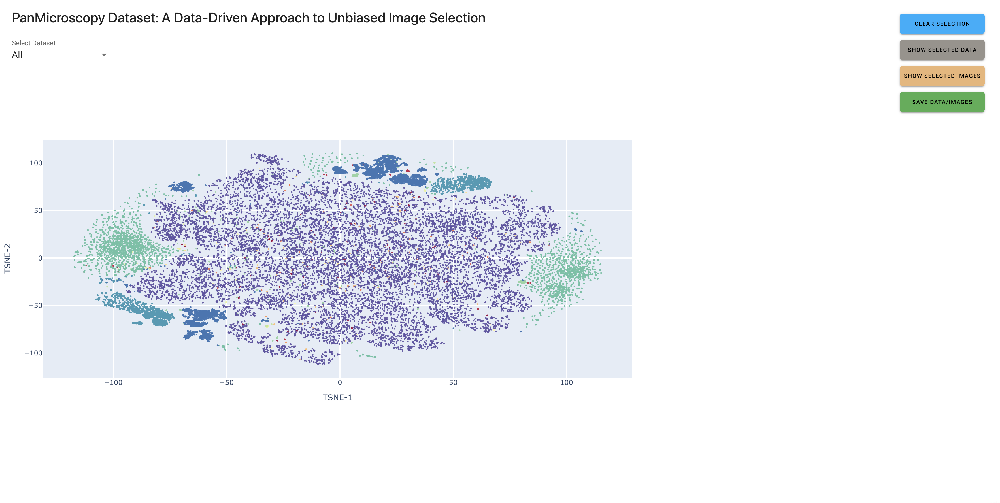

# PanMicroscopy Dashboard

A data-driven approach to unbiased image selection using Python and Solara for interactive visualization.

## Overview

This project allows users to interactively explore and analyze microscopy data from different datasets. Key features include:
- **Interactive Scatter Plot**: Visualize t-SNE dimensions of microscopy images from various datasets.
- **Dataset Filtering**: Select data from specific datasets or view all datasets combined.
- **Image Display**: Show selected images with details like dataset, cell type, and channel name.
- **Data Table**: Display metadata of selected data points.
- **Save Data/Images**: Save metadata and images of selected data points.

## Features

- **Data Loading**: Utilizes PyArrow for efficient reading of large datasets in `.arrow` format.
- **Visualization**: 
  - Scatter plots with Plotly for interactive data exploration.
  - Image plotting with Matplotlib for displaying selected images.
- **User Interface**: Designed with Solara for a reactive, web-based GUI.

## Installation

To install and run this project, follow these steps:

### Prerequisites
- Python 3.11.10
- pip (or conda for environment management)

### Setup

1. **Clone the repository:**
   ```bash
   git clone git@github.com:hamshkhawar/PanMicroscopy-dashboard.git
   cd PanMicroscopy-dashboard

2. **Setting up environment:**
   ```bash
   conda env create -f environment.yml

3. **Run the application:**
   ```bash
   SOLARA_ROOT_PATH=${JUPYTERHUB_SERVICE_PREFIX}/proxy/8765 solara run app.py

#### Usage
* Launch the application in your browser.
* Use the dropdown to select a dataset or view all.
* Click on points in the scatter plot to select images and data.
* Use buttons to display selected data in tabular form or show images.

#### Dashboard Image


## License

This project is licensed under the MIT License - see the [LICENSE](LICENSE) file for details.